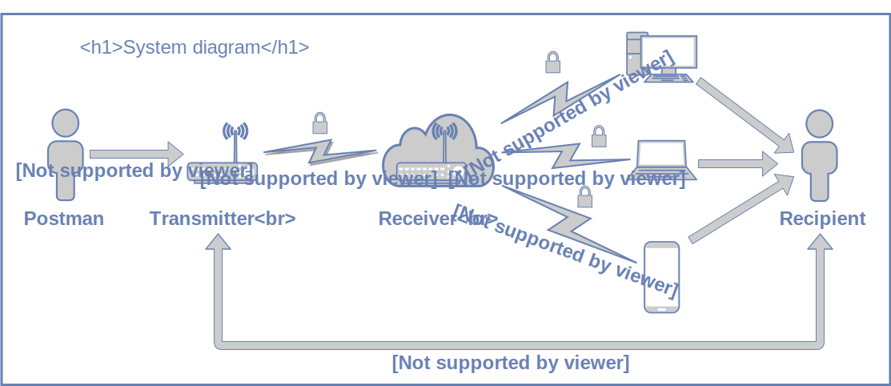

## Welcome

Mailnotifier, as the name suggests, notifies you when you get mail. It uses LoRa and WiFi to send you a message within Slack as soon as your mail is in your mailbox.

## Used Hardware

Here is a list of the hardware used for this project:
- [2x Adafruit Feather M0 WiFi with uFL - ATSAMD21 + ATWINC1500 with uFL Antenna and loose headers](https://www.adafruit.com/product/3061)
- [2x Adafruit LoRa Radio FeatherWing - RFM95W 900 MHz - RadioFruit](https://www.adafruit.com/product/3231)
- 2x LoRa Antenna with uFL Connector
- WiFi Antenna with uFL Connector
- Load Cell  
- [SparkFun Load Cell Amplifier - HX711](https://www.sparkfun.com/products/13879)
- JST PH 2-Pin Cable (Female Connector) (2x if you want to power the receiver with batteries too)
- Battery holder for 18650 batteries (same as above)
- 18650 batteries

## How To

Before you can use this code, you have to change a few things.

First of all, you have to enter your WiFi information in *arduino_secrets.h*. To do this, you need to write your WiFi name (the SSID) within the first quotation marks and your password within the second quotation marks.

Secondly, you need to create a webhook for Slack to send messages when you receive mail. Just follow [this simple tutorial](https://api.slack.com/incoming-webhooks). After you got the URL to the Channel you want to get the messages in, you need to find the line within *mailnotifier_Receiver* that starts with **_client.println("POST_** and ends with **_HTTP/1.1");_**. Copy everything after the **_.com_** part of your URL and paste it in between this two parts.

Lastly, you need to calibrate your load cell (do this after the load cell is placed in the mailbox). To do this, you need to run the calibration sketch. With it you'll find the **_calibration_factor_** and the **_zero_factor_**. Replace the numbers associated with these two factors within *mailnotifier_Transmitter* with the numbers you just found with this sketch.

## Used libraries

For this project we used the following libraries:
- SPI (Standard library used for communication to RF95 LoRa module via SPI) -> [SPI documentation] (https://www.arduino.cc/en/Reference/SPI)
- WiFi101 (Library for SSL encrypted communication via the ATWINC1500 wifi chip) ->
[Wifi101 documentation](https://www.arduino.cc/en/Reference/WiFi101)
- RH_RF95 (as part of the radiohead library you can downoad -> [here](https://github.com/adafruit/RadioHead)
- Adafruit_SleepyDog (Watchdog and Powersaving implementation) -> [github repo](https://github.com/adafruit/Adafruit_SleepyDog)
- HX711 (For taking weight measurements) -> [github repo](https://github.com/bogde/HX711)

## Diagrams

### System diagram (Mailnotifier)


### System diagram (Mailnotifier)


### Requirements diagram (Mailnotifier)
```pdf
	Diagrams/RequirementsDiagram.pdf
```
